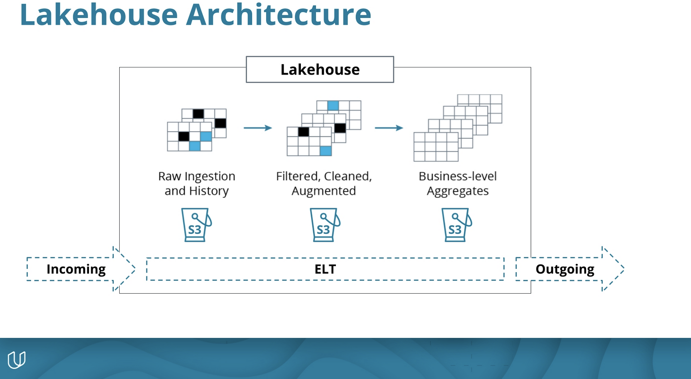

# STEDI Human Balance Analytics Lakehouse Project

## Introduction
The STEDI team wants to use motion sensor data to train a machine learning model to accurately detect steps in real-time. They require a data lakehouse solution. Not all early adopters have agreed to share their data, so the team needs a scalable and flexible architecture to handle varying data sources and volumes.

The diagram below demonstrates the lakehouse architecture.

## Data Files
There are three JSON files:
- **Customer data:** Includes consent to release information for research purposes. There are 956 rows in the raw JSON customer data file.
- **Data from step trainer:** A motion sensor that records the distance of the object detected. The step trainer file contains 28,680 rows.
- **Accelerometer data:** Uses a mobile phone accelerometer to detect motion in the X, Y, and Z directions. The accelerometer file has 81,273 rows.

## Requirements
The original data is transformed into SQL tables in three different zones: 
1. Landing Zone
   - Glue tables **customer_landing**, **accelerometer_landing**, and **step_trainer_landing**
   - Include SQL scripts for the three tables
3. Trusted Zone
   - Glue tables for **customer_trusted** and **accelerometer_trusted**
   - Verification of records in the customer_trusted glue table
5. Curated
   - Glue table **customers_curated** with matched records of customers who have accelerometer data and have agreed to share their data for research
   - Glue table **machine_learning_curated** that has each of the Step Trainer Readings, and the associated accelerometer reading data for the same timestamp, but only for customers who have agreed to share their data

## Project Steps
AWS Glue Configuration
   - Create an S3 Bucket and load raw data into the landing subdirectory
   - Create an S3 Gateway Endpoint to allow S3 traffic from your Glue Jobs into your S3 buckets
   - Create the Glue Service Role in IAM and grant access to the S3 bucket and attach general Glue policy

## Specifics on Data in Each Zone
